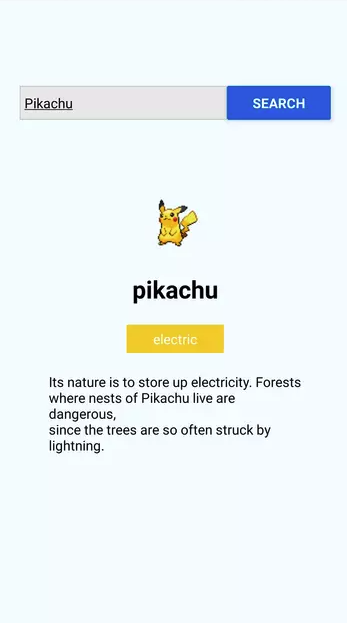

# poke-search
[![Contributors][contributors-shield]][contributors-url]
[![Forks][forks-shield]][forks-url]
[![Stargazers][stars-shield]][stars-url]
[![Issues][issues-shield]][issues-url]

 

  
  <h3 align="center">Poke Search</h3>

  

     
    <a href="https://github.com/the-turing-index/web-app"><strong>Explore the docs »</strong></a>
     
     
    <a href="https://github.com/the-turing-index/web-app/issues">Report Bug</a>
    ·
    <a href="https://github.com/the-turing-index/web-app/issues">Request Feature</a>
  

## Abstract
This app was created via [Sitepoint's tutorial by Wern Ancheta](https://www.sitepoint.com/getting-started-with-react-native/). The app allows users to look up pokemon by name via searchbar. It returns the Pokemon name, type, and brief description.

### Screenshot(s)

[contributors-shield]: https://img.shields.io/github/contributors/the-turing-index/web-app.svg?style=flat-square
[contributors-url]: https://github.com/the-turing-index/web-app/graphs/contributors
[forks-shield]: https://img.shields.io/github/forks/the-turing-index/web-app.svg?style=flat-square
[forks-url]: https://github.com/the-turing-index/web-app/network/members
[stars-shield]: https://img.shields.io/github/stars/the-turing-index/web-app.svg?style=flat-square
[stars-url]: https://github.com/the-turing-index/web-app/stargazers
[issues-shield]: https://img.shields.io/github/issues/the-turing-index/web-app.svg?style=flat-square
[issues-url]: https://github.com/the-turing-index/web-app/issues
[license-shield]: https://img.shields.io/github/license/the-turing-index/web-app.svg?style=flat-square
[license-url]: https://github.com/the-turing-index/web-app/blob/master/LICENSE.txt
[product-screenshot]: images/screenshot.png